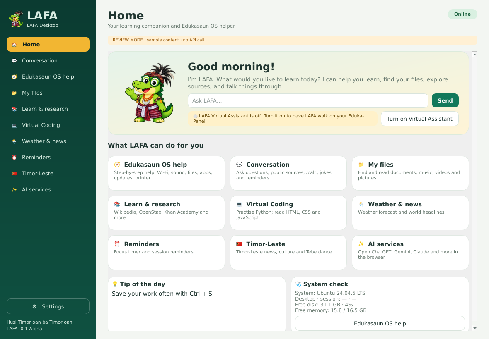
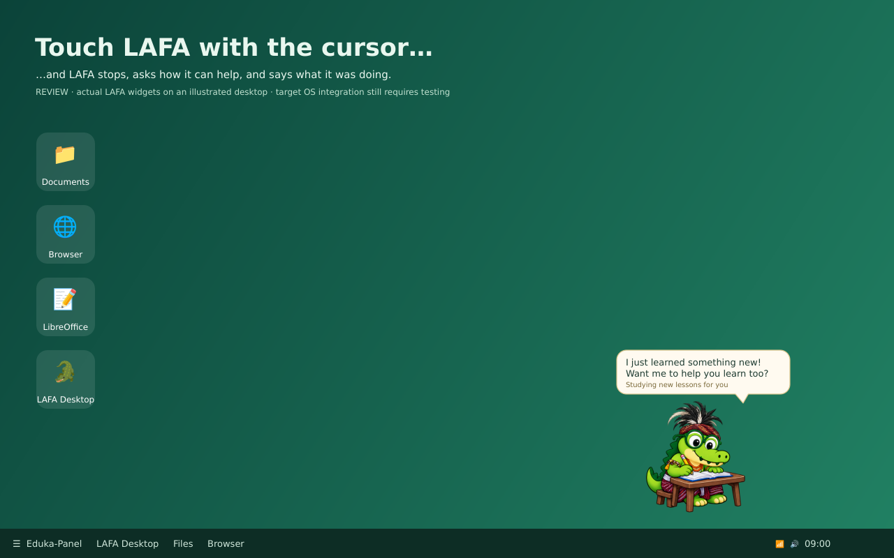

# LAFA

**LAFA 0.1 Alpha** (`0.1.0a1`) is an open-source native desktop learning assistant and
animated crocodile companion from Timor-Leste. LAFA has **no main server**: it
relies only on the internet, public open sources and open-source software.
Development restarted at 0.1 Alpha; every feature is being re-checked from the
beginning (see [CHANGELOG](CHANGELOG.md)). Source, build scripts and developer
documentation are in English. The interface follows the user's system language,
with English, Indonesian, Portuguese and Tetun overrides. No `.deb` is produced.





The second image uses actual LAFA widget pixels on an **illustrated desktop**;
it does not show installation on Edukasaun OS. Other captures are offscreen Qt
renders. [View all 23 captures](docs/SCREENSHOTS.md) — regenerate them after
every UI change with `scripts/capture-screenshots.py`.

## Three surfaces

| Surface | What it does | Entry point |
|---|---|---|
| **LAFA Desktop** | Home dashboard, chat, **Edukasaun OS help**, files, learning, coding, weather/news, reminders, Timor-Leste, AI services | Edukasaun menu; `lafa` or `lafa --window` |
| **LAFA Virtual Assistant** | The character on the Eduka-Panel: walks, does activities, asks “Can I help?” on hover, chats on click, tells jokes | Turn on from Home or Eduka-Settings → LAFA; `lafa --virtual` |
| **Eduka-Settings → LAFA** | Every LAFA preference: activation, outfit, panel, personality, activity timing, AI provider/model, language, folders, weather | Native page `integration/eduka_lafa_settings.py`; LAFA's own window `lafa --settings` |

## What LAFA does

**LAFA Desktop** (Edukasaun menu)
- **Home**: time-of-day greeting, quick question box, Virtual Assistant on/off,
  cards for everything LAFA can do, tip of the day and a read-only system check
  (OS, desktop session, free disk, memory, battery).
- **Edukasaun OS help**: 16 offline step-by-step guides in four languages —
  Wi-Fi, sound, screen/projector, files, installing apps, updates, printer, USB,
  screenshots, shortcuts, password, language/keyboard, accessibility, battery,
  LibreOffice and Eduka-Settings. **Open tool** starts the matching desktop tool
  from a fixed allowlist (for example `nm-connection-editor`, `pavucontrol-qt`,
  `pcmanfm-qt`, `system-config-printer`) without a shell; LAFA never changes
  system settings by itself. Questions such as “how do I connect wifi?”,
  “cara pasang aplikasi”, “oinsá liga Wi-Fi?” are answered from these guides,
  even without an AI key.
- **Chat** with suggestion chips, `/help`, `/os`, `/calc`, `/joke`, public
  sources, files, weather, news and reminders.

**LAFA Virtual Assistant** (off by default; activate it on Home or in
Eduka-Settings)
- Stands on the Eduka-Panel. When nobody needs help, it **walks to a new spot on
  the panel, then does an activity** — studying, reading, gaming, eating,
  bathing, sleeping, stretching, dancing Tebe-tebe or Bidu… — and walks again.
  Activity duration is configurable (20–600 s, default 60 s).
- Every activity is part of an assistant's working day ("Reading the Edukasaun
  OS guide", "Studying new lessons for you", "Power nap · recharging").
- **Cursor touches LAFA → it stops and asks how it can help.** The question
  changes every time and reacts to what LAFA was doing ("Eek! I'm in the bath!
  …But I can still help you."). Clicking the balloon or LAFA opens the chat.
- Personality: innocent, curious and funny, but clever and useful. LAFA
  sometimes comments on its activity, tells jokes, shows positive messages and
  Timor-Leste knowledge cards. Each behaviour can be switched off.
- On X11 it walks above the configured top/bottom panel edge. On Wayland the
  compositor controls placement; activities still change and LAFA can be dragged.

The first activation introduces LAFA with a time-of-day greeting: “Good
morning! I am LAFA, from Timor-Leste, a virtual assistant ready to help you.”
The outfit is the male traditional clothing: striped red tais wrap, white sash,
patterned head wrap and plume, bead necklaces and crescent chest ornament.

The latest Eduka-Settings source was not available, so the installer also
creates a standalone LAFA Settings entry, supplies the native page module and a
runnable integration test host. See [integration instructions](docs/EDUKA-INTEGRATION.md).

## More features

- Seventeen poses: idle, reading, thinking, walking, sitting, gaming, serious,
  mildly angry, talking, sleeping, bathing, toilet, studying, eating, stretching,
  **Tebe-tebe** and **Bidu**. Nine have traditional-costume illustrations.
- Positive notes and source-linked Timor-Leste cards above the character's head,
  default every five minutes while idle. Cards include Dili, tais, coffee, food,
  tourism and Tebe, with source URLs and an explicit source-check date.
  They are curated shipped facts, not continuously scraped assertions.
- Timor-Leste headline metadata from **Tatoli, Timor Post and the Government of
  Timor-Leste**, locally filtered for education, arts/culture, development and
  technology. Manual refresh and optional idle updates every 30 minutes show
  publisher and dates. Each publisher represents its own perspective.
- Key-free **public source mode**: explicit Wikipedia queries and article introductions,
  source links, weather, news, local filename search and supported reading.
  Greetings and supportive notes have prepared responses. Full conversational
  reasoning, personalized explanations and AI summaries use an optional API.
  Choose **Search public sources** or type `/ask topic` to send a public question.
  Ordinary chat text is never automatically sent to Wikipedia.
- **Open-source AI**: Ollama running free on this computer (no key), or any
  OpenAI-compatible open-source server (llama.cpp, vLLM, LocalAI, a school or
  community host) over HTTPS. **Fetch available models** lists real model IDs.
- Five optional official API adapters: OpenAI, Gemini, Claude, DeepSeek and Perplexity.
  The twelve service cards also link to Copilot, NotebookLM, Midjourney, Firefly,
  ElevenLabs, Cursor and Lovable. Account login happens in the system browser;
  a website subscription does not automatically give LAFA API access.
- Learning links and scoped browser searches for Ruangguru, wikiHow, Fandom,
  Everything2, Conservapedia, Miraheze and Baidu Baike, plus encyclopedias,
  Wikibooks, Wikiversity, Khan Academy, OpenStax and Internet Archive.
- **Virtual Coding**: editable beginner Python examples with a bounded AST
  interpreter supporting variables, arithmetic, lists, loops, conditions and
  print. Imports, file/network access, attributes, system commands and Python
  `eval`/`exec` are unavailable. JavaScript, HTML and CSS have read/export lessons;
  they are not executed. Explain with AI requires explicit code-transfer consent.
- Filename-based search within selected local folders; documents, music, video
  and pictures. TXT, MD, CSV, HTML, DOCX, ODT and text PDFs can be read locally.
  AI summaries ask before sending document text. No permanent file index.
- Current weather and three-day forecasts from Open-Meteo, default Dili, with
  explicit city selection for ambiguous names. World headlines from BBC/Guardian.
- In-memory session reminders, cancellation and a 25-minute focus timer.
- `/calc` safe calculator (no `eval`) and translated `/help` command list.
- The Virtual Assistant greets by time of day and hops when an answer arrives.
- Tetun/Indonesian/Portuguese Wikipedia searches fall back to English when
  the local edition has no result.
- Explicit eight-second microphone recording and OpenAI transcription; the
  transcript is placed in the input for review. Local espeak read-aloud. Tetun
  speech uses Portuguese pronunciation because a native Tetun voice is not bundled.
- Internet check every 30 seconds. Offline hides the character, stops animation
  and voice, disables requests and defers reminders. Settings stay accessible.

LAFA is not all-knowing. It distinguishes source extracts, browser links, live
metadata and AI responses. Network access alone does not create an AI model,
API key or paid credits. General browser searches are links, not fetched results.

## Run from source

Target: Linux, Python 3.11+, Qt 6, Edukasaun OS / Debian with X11 or Wayland.

```bash
cd lafa
python3 -m venv .venv
.venv/bin/python -m pip install -e .
./run-lafa.sh                 # LAFA Desktop
./run-lafa.sh --settings      # separate settings surface
./run-lafa.sh --virtual       # enabled companion, or Settings if disabled
```

Optional Debian runtime dependencies:

```bash
sudo apt install python3-venv libegl1 libopengl0 libxcb-cursor0 \
  libxkbcommon-x11-0 libxcb-xinerama0 fonts-noto-core fonts-noto-color-emoji \
  alsa-utils espeak-ng poppler-utils gnome-keyring
```

For user menu entries without a system package:

```bash
./scripts/install-user.sh
```

Keep the source folder at a stable location: the launcher uses its installed
virtual environment. The script creates LAFA Desktop (education / custom
Edukasaun category), LAFA Settings, and a hidden virtual-role desktop entry.
It installs the native settings helper under user data. There is no root
service or automatic startup. `scripts/uninstall-user.sh` removes these user
launchers and the environment; preferences and secure keyring are retained.

For a dedicated **Edukasaun** menu, the OS menu definition must route
`X-Edukasaun` to that menu. The category is supplied; the current OS menu was
not edited. Full host wiring is documented separately.

## AI setup

**Free and open-source (recommended to start):** install [Ollama](https://ollama.com/),
pull an open model (for example `ollama pull llama3.2`), then in LAFA Settings
choose **Ollama (open-source, local)**, press **Fetch available models**, pick
one and Save. No key and no paid credits are needed. The Ollama address must be
on this computer (`127.0.0.1`, `localhost` or `::1`). A school or community can
instead host an **OpenAI-compatible open-source server**; enter its HTTPS
address ending in `/v1` and an optional key.

**Commercial APIs (optional):** select a provider, enter an API key, press
**Fetch available models** (or type an official model ID), then Save. Perplexity uses its `fast` preset.
Settings has five categories: **Virtual Assistant**, **AI & language**,
**Personality & activities**, **Files & weather** and **About**; the same
preferences (except API keys) are on the Eduka-Settings → LAFA page. Closing without saving leaves provider/model preferences
unchanged. Saving preserves the coding editor, output and unsent chat draft.
No model ID is guessed from a changing model catalogue. Keys stay in session
memory unless secure keyring is selected. Secret Service/KWallet are accepted;
plaintext fallbacks are rejected. Environment variables in `.env.example` are
also supported; LAFA does not automatically load that file.

| Provider | Native connection | Browser login |
|---|---|---|
| OpenAI | Responses API | [ChatGPT](https://chatgpt.com/) |
| Google | Gemini GenerateContent | [Gemini](https://gemini.google.com/) |
| Anthropic | Claude Messages | [Claude](https://claude.ai/) |
| DeepSeek | Chat completions | [DeepSeek](https://chat.deepseek.com/) |
| Perplexity | Agent API, fast preset | [Perplexity](https://www.perplexity.ai/) |
| Ollama | Local `/api/chat`, open-source models | Not needed |
| Open-source server | OpenAI-compatible `/chat/completions` | Not needed |

Models, quotas, account permissions and pricing belong to each provider. There
is no universal sign-in, credential scraping or reuse of browser cookies.

## Commands

```text
/help
/os
/os wifi
/joke
/calc (3+4)*2
/weather
/weather Dili
/news
/timor education
/timor arts_culture
/timor technology
/remind 5 Drink water
/focus
/source Ruangguru: fractions
/ask Dili
/learn photosynthesis
/files lesson
/music Timor
/videos tutorial
/web videos Python lesson
/web documents mathematics
```

Direct commands work without an AI key. `/ask` sends one public topic of at most
300 characters to Wikipedia and returns a cited introduction. `/learn` searches
public source snippets. Ordinary chat stays local in source mode; prepared
greetings and supportive messages are available. The optional API can
interpret additional natural-language requests. Model actions are read-only
and validated: files, encyclopedia, browser search, weather, world news and
known learning-source links. `/timor` explicitly fetches local headlines.

## Validation and limits

[Validation results](docs/VALIDATION.md) and [security review](docs/SECURITY.md)
record checks and remaining limits. No software can be guaranteed unhackable.
This is a tested alpha implementation, not a certification of the current OS,
provider accounts, desktop compositor or all dependency vulnerabilities.

```bash
QT_QPA_PLATFORM=offscreen .venv/bin/python -m unittest discover -s tests -v
QT_QPA_PLATFORM=offscreen .venv/bin/python scripts/capture-screenshots.py
.venv/bin/python scripts/check-system.py             # read-only readiness report
.venv/bin/python scripts/check-system.py --network --json
```

The readiness check inspects runtime dependencies, assets, local activation and
launcher availability. `--network` explicitly requests Wikipedia, Dili weather
and Timor-Leste feed checks. It does not print keys, chat, model IDs or selected
folder paths. An isolated Qt probe reports initialization failures without
crashing the diagnostic parent process.

[Upload to GitHub](docs/GITHUB.md) · [Privacy](docs/PRIVACY.md) ·
[Architecture](docs/ARCHITECTURE.md) · [Asset provenance](docs/ASSETS.md)

Code license: MIT. The supplied character identity remains subject to its
owner's rights. New illustrations are included for this LAFA project.
