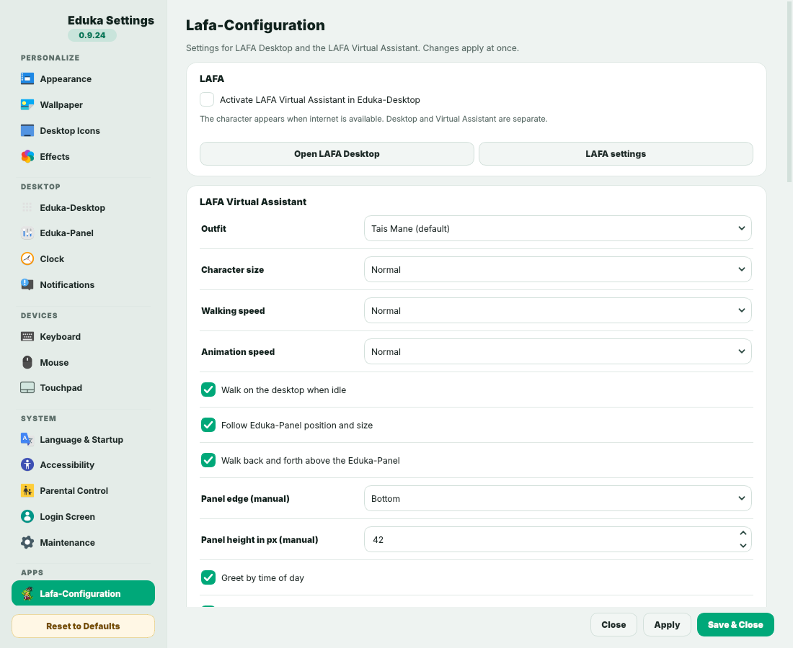
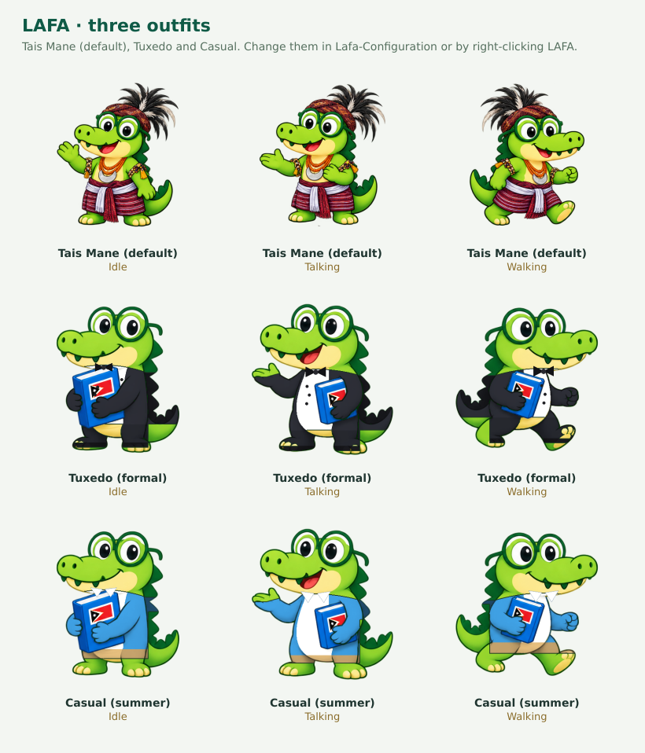

# LAFA

**LAFA 0.1.1 Alpha** is an open-source learning assistant and animated
crocodile companion from Timor-Leste for **Edukasaun OS** (Debian 13 Trixie,
LXQt) and the **Eduka-Desktop Suite** (Eduka-Desktop, Eduka-Panel,
Eduka-Settings). LAFA has **no main server**: it relies on the internet, public
open sources and open-source software. Source, scripts and developer
documentation are in English; the interface follows Eduka-Desktop's language
(English, Indonesian, Portuguese, Tetun). See the [CHANGELOG](CHANGELOG.md)
and [how to keep developing LAFA](docs/DEVELOPMENT.md).






[View all 31 captures](docs/SCREENSHOTS.md). Captures of LAFA on the desktop
are actual LAFA pixels on an **illustrated desktop**, not Edukasaun OS.

## Install on Edukasaun OS

```bash
sh tools/build-deb.sh                       # -> dist/lafa_0.1.1_all.deb
sudo apt install ./dist/lafa_0.1.1_all.deb  # dependencies come from Debian
```

`apt` installs every dependency automatically: `python3-pyqt5` (the same Qt
binding as the Eduka-Desktop suite), `libqt5svg5`, `python3-keyring`,
`fonts-noto-color-emoji` and more; recommended packages add read-aloud
(`espeak-ng`), PDF reading (`poppler-utils`), Papirus icons and the desktop
tools the IT help desk can open. The package installs LAFA Desktop in the
**Edukasaun** menu category, an autostart entry that runs only when the Virtual
Assistant is activated, and the **Lafa-Configuration** page for Eduka-Settings.
Inside Cubic it starts no GUI. Updating later is the same `apt install` command.

## Three surfaces

| Surface | What it does | Entry point |
|---|---|---|
| **LAFA Desktop** | A complete school room: teachers, homework & timetable, library, computer lab, notice board, IT help desk, files, Timor-Leste, AI services | Edukasaun menu; `lafa` |
| **LAFA Virtual Assistant** | The character on the Eduka-Panel: walks, does activities that suit its outfit, asks “Can I help?” on hover, chats on click | Activate on Home or in Lafa-Configuration; `lafa --virtual` |
| **Eduka-Settings → Lafa-Configuration** | Every LAFA preference: activation, outfit, size, speeds, personality, LAFA Desktop, language, AI, folders, weather | `lafa --configure` (falls back to LAFA's own window `lafa --settings`) |

## Compatible with the Eduka-Desktop Suite

- **Language**: LAFA's default "Follow Eduka-Desktop" uses the language chosen
  in Eduka-Settings (Tetun) or the session language.
- **Eduka-Panel**: LAFA reads the panel's edge, height and style (full,
  floating, short, dock) and stands exactly on top of it.
- **Theme**: LAFA Desktop follows the Eduka theme (including Edukasaun-Dark)
  and the accent colour.
- **Notifications**: reminders appear as Eduka-Panel notifications; homework
  due dates can go to the Eduka-Panel calendar agenda.
- **Eduka-Settings**: Lafa-Configuration is a native page (Eduka cards, rows,
  live apply). Eduka-Settings needs the generic plugin-pages patch
  ([integration](docs/EDUKA-INTEGRATION.md)); it was verified with the real
  eduka-settings 0.9.24.
- **Qt**: PyQt5 like the suite; on Wayland LAFA uses XWayland like Eduka.

## What LAFA does

**LAFA Desktop — a complete school**
- **Teachers**: Mathematics, Science, Languages, History & Geography, ICT &
  Coding, Arts & Culture and a Counsellor. Each has free learning resources,
  **offline practice** (maths exercises in three levels, vocabulary cards
  between Tetun, Portuguese, English and Indonesian, quizzes about science,
  Timor-Leste, digital safety and culture, study tips) and **Ask the teacher**
  with an AI provider (the free open-source Ollama works).
- **Homework & timetable**, stored on the computer; due dates can be added to
  the Eduka-Panel calendar. Home shows today's classes and homework due soon.
- **Library**, **Computer lab** (bounded Python lessons), **Notice board**
  (weather and headlines), **IT help desk** (16 Edukasaun OS guides with an
  allowlisted tool launcher), **My files**, **Reminders & focus**,
  **Timor-Leste**, **AI services**, and chat with `/help`, `/os`, `/calc`,
  `/joke`.
- **Always up to date**: LAFA refreshes the notice board and downloads the
  validated source catalog (links, teacher resources, Timor-Leste cards, tips)
  from its open-source repository, and announces new LAFA releases.

**LAFA Virtual Assistant**
- **Three outfits**: **Tais Mane** (default), **Tuxedo** and **Casual**. The
  outfit decides the activities: Tais Mane — school and daily life, Tebe-tebe
  and Bidu; Tuxedo — parties, meetings, presentations, graduation ceremonies,
  gala dinners, speeches; Casual — beach, sunbathing, beach ball, sightseeing,
  café, shopping, snacks. Change it in Lafa-Configuration or by right-clicking
  LAFA → Outfit.
- Walks to a new spot on the Eduka-Panel, then does an activity, then walks
  again. **Cursor touches LAFA → it stops and asks how it can help**, in
  character and reacting to what it is doing. Innocent, curious, clever and
  funny: it comments on its activities and tells jokes.
- Tunable in Lafa-Configuration: size, walking speed, animation speed,
  activity duration, balloon time, hover questions, self-talk, jokes.

The first activation introduces LAFA with a time-of-day greeting: “Good
morning! I am LAFA, from Timor-Leste, a virtual assistant ready to help you.”

## More features

- Seventeen poses: idle, reading, thinking, walking, sitting, gaming, serious,
  mildly angry, talking, sleeping, bathing, toilet, studying, eating, stretching,
  **Tebe-tebe** and **Bidu**. Nine have traditional-costume illustrations.
- Positive notes and source-linked Timor-Leste cards above the character's head,
  default every five minutes while idle. Cards include Dili, tais, coffee, food,
  tourism and Tebe, with source URLs and an explicit source-check date.
  They are curated shipped facts, not continuously scraped assertions.
- Timor-Leste headline metadata from **Tatoli, Timor Post and the Government of
  Timor-Leste**, locally filtered for education, arts/culture, development and
  technology. Manual refresh and optional idle updates every 30 minutes show
  publisher and dates. Each publisher represents its own perspective.
- Key-free **public source mode**: explicit Wikipedia queries and article introductions,
  source links, weather, news, local filename search and supported reading.
  Greetings and supportive notes have prepared responses. Full conversational
  reasoning, personalized explanations and AI summaries use an optional API.
  Choose **Search public sources** or type `/ask topic` to send a public question.
  Ordinary chat text is never automatically sent to Wikipedia.
- **Open-source AI**: Ollama running free on this computer (no key), or any
  OpenAI-compatible open-source server (llama.cpp, vLLM, LocalAI, a school or
  community host) over HTTPS. **Fetch available models** lists real model IDs.
- Five optional official API adapters: OpenAI, Gemini, Claude, DeepSeek and Perplexity.
  The twelve service cards also link to Copilot, NotebookLM, Midjourney, Firefly,
  ElevenLabs, Cursor and Lovable. Account login happens in the system browser;
  a website subscription does not automatically give LAFA API access.
- Learning links and scoped browser searches for Ruangguru, wikiHow, Fandom,
  Everything2, Conservapedia, Miraheze and Baidu Baike, plus encyclopedias,
  Wikibooks, Wikiversity, Khan Academy, OpenStax and Internet Archive.
- **Virtual Coding**: editable beginner Python examples with a bounded AST
  interpreter supporting variables, arithmetic, lists, loops, conditions and
  print. Imports, file/network access, attributes, system commands and Python
  `eval`/`exec` are unavailable. JavaScript, HTML and CSS have read/export lessons;
  they are not executed. Explain with AI requires explicit code-transfer consent.
- Filename-based search within selected local folders; documents, music, video
  and pictures. TXT, MD, CSV, HTML, DOCX, ODT and text PDFs can be read locally.
  AI summaries ask before sending document text. No permanent file index.
- Current weather and three-day forecasts from Open-Meteo, default Dili, with
  explicit city selection for ambiguous names. World headlines from BBC/Guardian.
- In-memory session reminders, cancellation and a 25-minute focus timer.
- `/calc` safe calculator (no `eval`) and translated `/help` command list.
- The Virtual Assistant greets by time of day and hops when an answer arrives.
- Tetun/Indonesian/Portuguese Wikipedia searches fall back to English when
  the local edition has no result.
- Explicit eight-second microphone recording and OpenAI transcription; the
  transcript is placed in the input for review. Local espeak read-aloud. Tetun
  speech uses Portuguese pronunciation because a native Tetun voice is not bundled.
- Internet check every 30 seconds. Offline hides the character, stops animation
  and voice, disables requests and defers reminders. Settings stay accessible.

LAFA is not all-knowing. It distinguishes source extracts, browser links, live
metadata and AI responses. Network access alone does not create an AI model,
API key or paid credits. General browser searches are links, not fetched results.

## Run from source (developers)

See [docs/DEVELOPMENT.md](docs/DEVELOPMENT.md). In short:

```bash
sudo apt install python3-pyqt5 libqt5svg5 python3-keyring papirus-icon-theme fonts-noto-color-emoji
LAFA_QT=pyqt5 python3 -m lafa.app --review     # Edukasaun OS stack (PyQt5)
python3 -m venv .venv && .venv/bin/pip install -e . && LAFA_QT=pyside6 .venv/bin/lafa --review   # PySide6
```

`scripts/install-user.sh` still creates per-user launchers from a source
checkout; the `.deb` is the recommended way on Edukasaun OS.

## AI setup

**Free and open-source (recommended to start):** install [Ollama](https://ollama.com/),
pull an open model (for example `ollama pull llama3.2`), then in LAFA Settings
choose **Ollama (open-source, local)**, press **Fetch available models**, pick
one and Save. No key and no paid credits are needed. The Ollama address must be
on this computer (`127.0.0.1`, `localhost` or `::1`). A school or community can
instead host an **OpenAI-compatible open-source server**; enter its HTTPS
address ending in `/v1` and an optional key.

**Commercial APIs (optional):** select a provider, enter an API key, press
**Fetch available models** (or type an official model ID), then Save. Perplexity uses its `fast` preset.
Settings has five categories: **Virtual Assistant**, **AI & language**,
**Personality & activities**, **Files & weather** and **About**; the same
preferences (except API keys) are on the Eduka-Settings → LAFA page. Closing without saving leaves provider/model preferences
unchanged. Saving preserves the coding editor, output and unsent chat draft.
No model ID is guessed from a changing model catalogue. Keys stay in session
memory unless secure keyring is selected. Secret Service/KWallet are accepted;
plaintext fallbacks are rejected. Environment variables in `.env.example` are
also supported; LAFA does not automatically load that file.

| Provider | Native connection | Browser login |
|---|---|---|
| OpenAI | Responses API | [ChatGPT](https://chatgpt.com/) |
| Google | Gemini GenerateContent | [Gemini](https://gemini.google.com/) |
| Anthropic | Claude Messages | [Claude](https://claude.ai/) |
| DeepSeek | Chat completions | [DeepSeek](https://chat.deepseek.com/) |
| Perplexity | Agent API, fast preset | [Perplexity](https://www.perplexity.ai/) |
| Ollama | Local `/api/chat`, open-source models | Not needed |
| Open-source server | OpenAI-compatible `/chat/completions` | Not needed |

Models, quotas, account permissions and pricing belong to each provider. There
is no universal sign-in, credential scraping or reuse of browser cookies.

## Commands

```text
/help
/os
/os wifi
/joke
/calc (3+4)*2
/weather
/weather Dili
/news
/timor education
/timor arts_culture
/timor technology
/remind 5 Drink water
/focus
/source Ruangguru: fractions
/ask Dili
/learn photosynthesis
/files lesson
/music Timor
/videos tutorial
/web videos Python lesson
/web documents mathematics
```

Direct commands work without an AI key. `/ask` sends one public topic of at most
300 characters to Wikipedia and returns a cited introduction. `/learn` searches
public source snippets. Ordinary chat stays local in source mode; prepared
greetings and supportive messages are available. The optional API can
interpret additional natural-language requests. Model actions are read-only
and validated: files, encyclopedia, browser search, weather, world news and
known learning-source links. `/timor` explicitly fetches local headlines.

## Validation and limits

[Validation results](docs/VALIDATION.md) and [security review](docs/SECURITY.md)
record checks and remaining limits. No software can be guaranteed unhackable.
This is a tested alpha implementation, not a certification of the current OS,
provider accounts, desktop compositor or all dependency vulnerabilities.

```bash
QT_QPA_PLATFORM=offscreen .venv/bin/python -m unittest discover -s tests -v
QT_QPA_PLATFORM=offscreen .venv/bin/python scripts/capture-screenshots.py
.venv/bin/python scripts/check-system.py             # read-only readiness report
.venv/bin/python scripts/check-system.py --network --json
```

The readiness check inspects runtime dependencies, assets, local activation and
launcher availability. `--network` explicitly requests Wikipedia, Dili weather
and Timor-Leste feed checks. It does not print keys, chat, model IDs or selected
folder paths. An isolated Qt probe reports initialization failures without
crashing the diagnostic parent process.

[Upload to GitHub](docs/GITHUB.md) · [Privacy](docs/PRIVACY.md) ·
[Architecture](docs/ARCHITECTURE.md) · [Asset provenance](docs/ASSETS.md)

Code license: MIT. The supplied character identity remains subject to its
owner's rights. New illustrations are included for this LAFA project.
