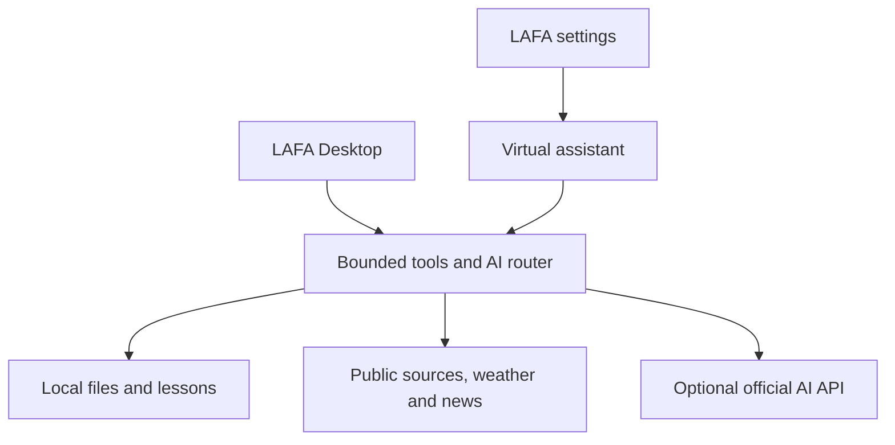
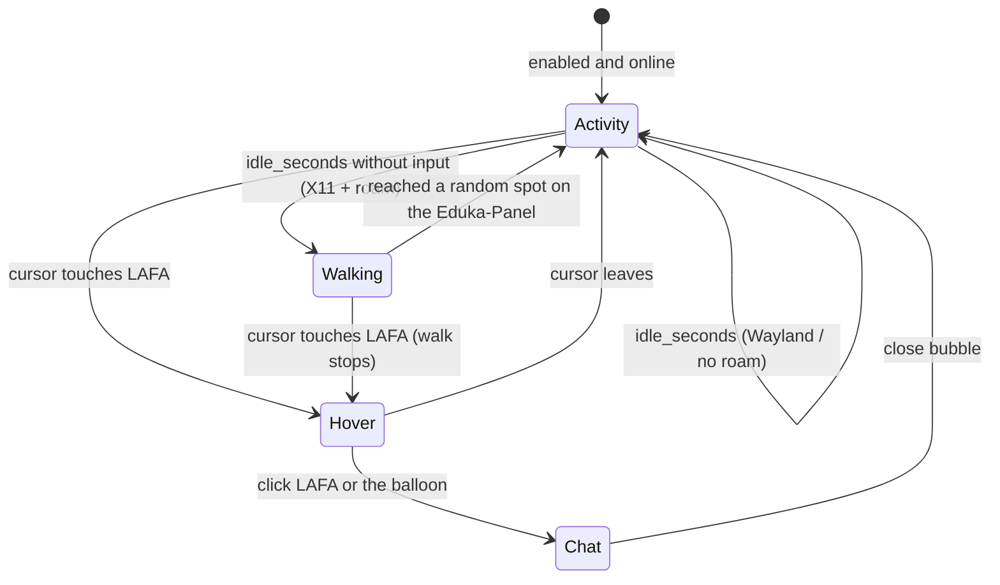

# Architecture

LAFA is a Python/PySide6 native client with one shared process and three
independently visible surfaces: Desktop, Settings and Virtual Assistant. There
is no dedicated network server, embedded login browser or background service.

Eduka-Settings → LAFA (or LAFA's own settings window) enables the mascot and
holds language, outfit, personality, activity timing, AI provider, files and
weather. Saving in Eduka-Settings writes the preferences file and sends the
fixed `reload` role; API keys never pass through the host page. Desktop alone never enables it. Same-user IPC routes fixed launch
roles to the process holding the instance lock. Browser sign-in is independent
of API access and belongs to the user's browser.

| Module | Responsibility |
|---|---|
| app | Desktop pages (Home, Chat, Edukasaun OS help, Files, Learn, Coding, Weather & news, Reminders, Timor-Leste, AI services), Eduka-Settings-style settings window, live reload, worker delivery, tray |
| mascot | Atlases, costumes, chat bubble, hover/thought balloon, walk-then-activity cycle on the Eduka-Panel (X11), popup clock |
| qt | Single Qt import point: PyQt5 (Edukasaun OS) or PySide6 (developers) |
| eduka | Eduka-Desktop suite compatibility: language, panel geometry, theme/accent, notifications, agenda, XWayland, Lafa-Configuration launcher |
| outfits | Tais Mane / Tuxedo / Casual, outfit activities and their vector scenes, Timor-Leste flag icon |
| school | Teachers, offline practice (maths, vocabulary, quizzes, tips), homework and timetable storage |
| updates | Validated online source catalog, cache, merge, release check |
| personality | LAFA's character: assistant duty per activity, hover questions, activity reactions, self-talk and jokes in EN/ID/PT/TET |
| osguide | Offline Edukasaun OS guides, fixed tool allowlist launched without a shell, read-only system check, tips |
| calculator | `/calc` arithmetic parsed with `ast`, never `eval` |
| agent | Direct commands, Edukasaun OS guide matching, optional model envelopes/actions, cited key-free extracts |
| timor | Three local feeds, topic filtering, curated multilingual culture cards |
| learning | Bounded AST teaching interpreter and examples; no host execution |
| tools | Bounded local filename search, secure document access, Wikipedia and browser links |
| pdf_worker | Resource-limited Poppler conversion of a private input copy |
| live_info | Geocoding, forecasts, RSS metadata and source dates |
| instance | Framed and bounded same-user launch-role socket |
| providers/net | Official schemas, HTTPS bounds, redirect refusal, reachability |
| config | System-language preference, XDG settings and secure secrets |
| desktop_entry | Two-layer freedesktop Exec quoting for fixed launcher paths |
| voice/reminders | Explicit recording, local playback, in-memory timers |
| integration/eduka_lafa_settings | Binding-preserving Eduka-Settings page: activation group plus every non-secret LAFA preference; atomic save and `--reload` |
| integration/demo_eduka_settings | Clearly labeled runnable host for reviewing the actual integration widget |
| scripts/check-system | Read-only readiness report, isolated Qt probe and opt-in public checks |

Blocking network work, file scans, lessons, PDF conversion and voice run outside
the UI thread. QObject receivers deliver completion/error handling on that
thread. Local filenames are never sent back to models. Documents and lesson code
require separate transfer confirmation. Model actions cannot execute commands.

Source mode formats actual Wikipedia introductions after an explicit public
search action or `/ask`, not generated reasoning. Ordinary chat never triggers
an automatic public query; greetings/support can use local prepared replies.
Curated culture cards have check dates and links; news/weather
have publication/data/retrieval times. Neither failures nor empty feed windows
are replaced by sample content during normal operation.

Filename search stops at 40,000 entries, depth 10, eight seconds or 120 matches.
Documents stop at 10 MB and 20,000 preview characters; PDF reads 30 pages.
Lessons stop at 20,000 code characters, 1,200 AST nodes and 10,000 interpreter
steps with nested-value and output bounds. This is not a full Python runtime.

Idle time is monotonic and observes LAFA input only. Busy work, open bubble,
pause, dragging and offline status suppress random activity. Network checks do
not restart idle timing. Popups dismiss after 15 seconds unless the user
interacts. Local headlines are refreshed at a configurable interval only when
Virtual Assistant and news updates are enabled; automatic popups wait for idle.
Disabling all card types does not block activity rotation. A typed draft, open
bubble or pause suppresses unsolicited popups. Provider/model preference edits
are drafted until Save; rebuilding the UI preserves code, output and chat draft.

On X11, only the walking state changes window position above/below the configured
panel. Wayland owns position. Animation is procedural around still illustrations;
the character does not actually bathe, play games or perform a full dance rig.

## Virtual Assistant behaviour

Busy work, an open bubble, an unsent draft, dragging, pause and offline state
suppress the cycle. Only events inside LAFA's own windows are observed.
