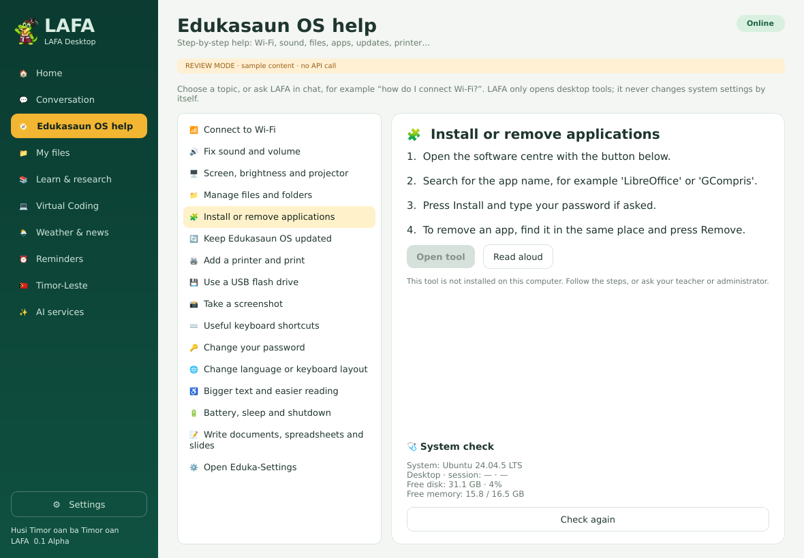
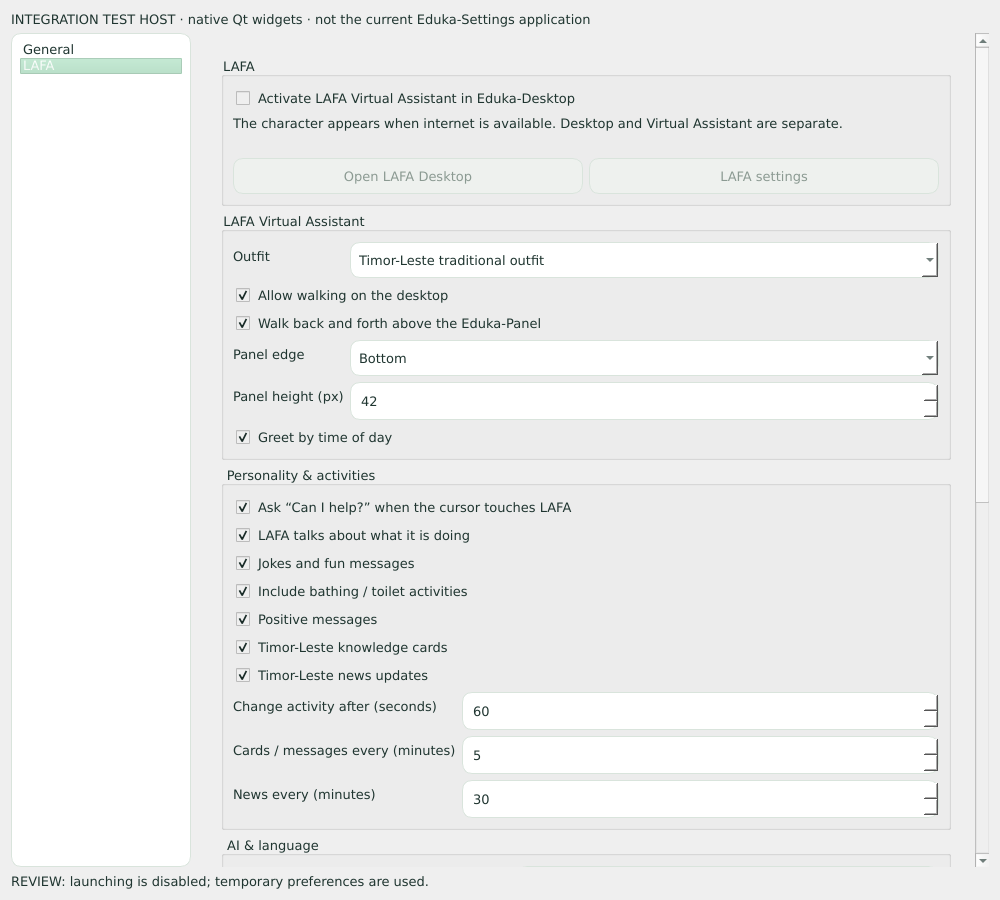

# Screenshot review — LAFA 0.1 Alpha (redesign)

Regenerate after every UI change so developers can review and keep improving:

```bash
QT_QPA_PLATFORM=offscreen .venv/bin/python scripts/capture-screenshots.py
```

The script uses actual Qt widgets and `QWidget.grab()`. Review mode makes no
internet/API calls and writes preferences only to a temporary folder. Sample
weather, headlines and sources are labelled `SAMPLE`. Greetings are fixed to
"morning" so captures do not depend on the capture time.

| # | File | Content |
|---|---|---|
| 01 | `01-home.png` | New Home dashboard: greeting, quick ask, Virtual Assistant status/toggle, "What LAFA can do" cards, tip of the day, system check |
| 02 | `02-conversation.png` | Chat with suggestion chips; an Edukasaun OS question answered by the offline guide with **Open tool** and `/calc` |
| 03 | `03-edukasaun-os-help.png` | Edukasaun OS help: 16 topics, steps, allowlisted tool launcher, read-only system check |
| 04 | `04-local-files.png` | Filename search of four temporary sample documents |
| 05 | `05-learn-research.png` | Learn & research with sample Wikipedia rows and learning-site links |
| 06 | `06-virtual-coding.png` | Python lesson with actual output from the bounded interpreter |
| 07 | `07-weather-news.png` | Weather and world headlines (sample fixtures) |
| 08 | `08-reminders.png` | Session reminders and 25-minute focus |
| 09 | `09-timor-leste.png` | Timor-Leste news topics and culture (sample rows) |
| 10 | `10-ai-services.png` | AI service cards that open in the browser |
| 11 | `11-offline.png` | Offline state: requests disabled, character paused |
| 12 | `12-settings-virtual-assistant.png` | Settings window (Eduka-Settings style) · Virtual Assistant |
| 13 | `13-settings-personality.png` | Settings · Personality & activities (hover questions, self-talk, jokes, activity duration) |
| 14 | `14-settings-ai-language.png` | Settings · AI & language (open-source Ollama / server, fetch models) |
| 15 | `15-eduka-settings-lafa-page.png` | The native **Eduka-Settings → LAFA** page with all preferences, in the integration test host |
| 16 | `16-virtual-walking-on-panel.png` | LAFA walking on the Eduka-Panel (illustrated desktop) |
| 17 | `17-virtual-hover-question.png` | Cursor touches LAFA while studying: "Can I help?" balloon with the current duty |
| 18 | `18-virtual-funny-activity.png` | Caught in the bath — the innocent, funny character |
| 19 | `19-virtual-chat-bubble.png` | Click LAFA: chat bubble with OS help, weather, news, focus and joke buttons |
| 20 | `20-character-activities.png` | All 17 activities with the assistant duty each represents |
| 21 | `21-traditional-dances.png` | Traditional outfit, Tebe-tebe and Bidu |
| 22 | `22-home-indonesian.png` | Home in Bahasa Indonesia |
| 23 | `23-home-tetun.png` | Home in Tetun |

Captures 16–19 are **compositions of actual LAFA widget pixels on a painted
desktop and panel**. They are not screenshots of Edukasaun OS. Real panel
walking, compositor transparency and tray placement still need testing on the
target OS. Capture 15 shows the supplied page in a small test host, not the
current Eduka-Settings application.




