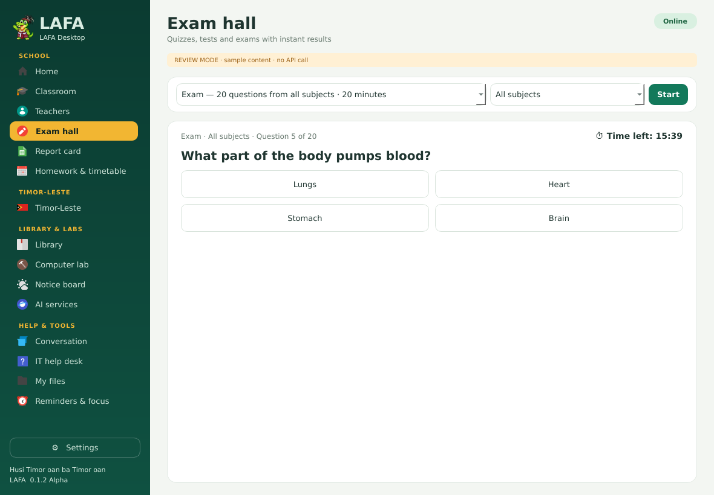
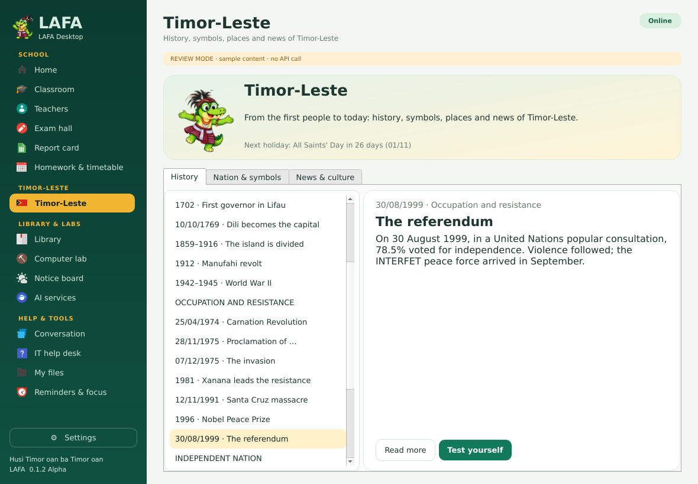
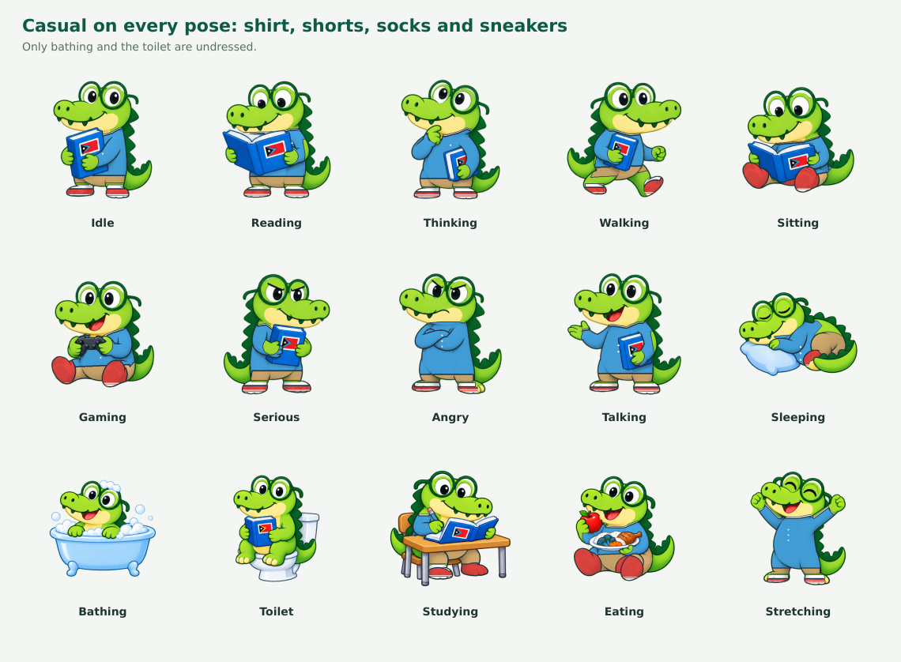
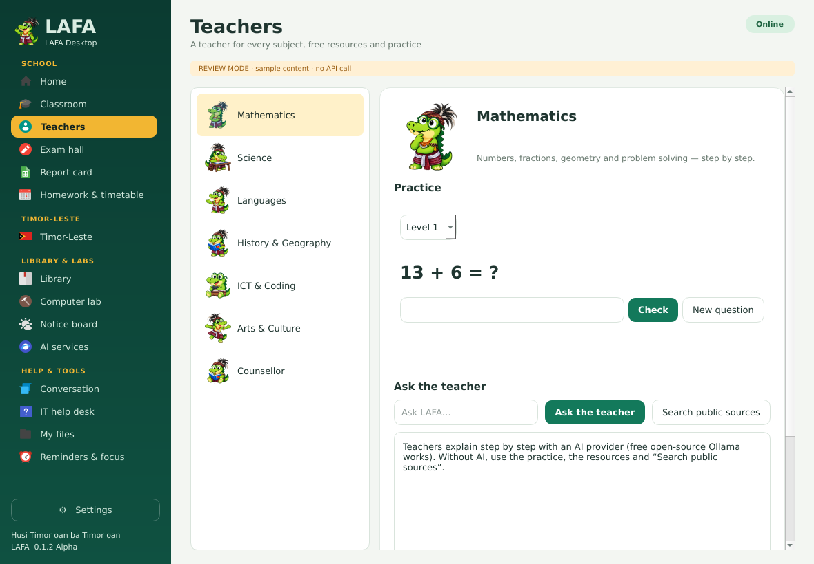

# Screenshot review — LAFA 0.1.2 Alpha

Regenerate after every UI change so developers can review and keep improving:

```bash
QT_QPA_PLATFORM=offscreen LAFA_QT=pyqt5 python3 scripts/capture-screenshots.py
# with the real Eduka-Settings (captures 18–19):
EDUKA_DESKTOP_SRC=/path/to/Eduka-Desktop QT_QPA_PLATFORM=offscreen LAFA_QT=pyqt5 python3 scripts/capture-screenshots.py
```

Captured with **PyQt5 / Qt 5.15 and the Papirus icon theme**, the same stack
as Edukasaun OS. Review mode makes no internet/API calls; preferences and
homework go to a temporary folder. Weather, headlines and sources are labelled
`SAMPLE`. Greetings are fixed to "morning".

| # | File | Content |
|---|---|---|
| 01 | `01-home.png` | Home (school lobby): greeting, quick ask, Virtual Assistant toggle, feature cards, today's classes, homework due, tip, system check |
| 02 | `02-teachers-mathematics.png` | Mathematics teacher: generated exercises with levels, score, ask the teacher, free resources |
| 03 | `03-teachers-languages.png` | Languages teacher: vocabulary cards between Tetun, Portuguese, English and Indonesian |
| 04 | `04-teachers-history-quiz.png` | History & Geography quiz about Timor-Leste |
| 05 | `05-homework.png` | Homework planner (optionally added to the Eduka-Panel calendar) |
| 06 | `06-timetable.png` | Weekly timetable |
| 07 | `07-conversation.png` | Chat: Edukasaun OS question answered by the offline guide, `/calc` |
| 08 | `08-it-help-desk.png` | IT help desk (Edukasaun OS help) with allowlisted tool launcher and system check |
| 09 | `09-library.png` | Library (public sources, learning sites) |
| 10 | `10-computer-lab.png` | Computer lab (bounded Python lessons) |
| 11 | `11-notice-board.png` | Notice board: weather and world headlines (sample) |
| 12 | `12-timor-leste.png` | Timor-Leste · news and culture tab (sample) |
| 13 | `13-my-files.png` | File search in temporary sample folders |
| 14 | `14-ai-services.png` | AI services opened in the browser |
| 15 | `15-offline.png` | Offline state |
| 16 | `16-lafa-settings-virtual-assistant.png` | LAFA's own settings window (fallback) · Virtual Assistant tuning |
| 17 | `17-lafa-settings-desktop.png` | LAFA's own settings window · LAFA Desktop (start page, theme, notifications, updates) |
| 18 | `18-eduka-settings-lafa-configuration.png` | **Real Eduka-Settings 0.9.24 with Lafa-Configuration** (APPS group) |
| 19 | `19-eduka-settings-lafa-configuration-2.png` | Lafa-Configuration, personality and LAFA Desktop cards |
| 20 | `20-virtual-walking-on-panel.png` | LAFA walking on a floating Eduka-Panel |
| 21 | `21-virtual-hover-question.png` | Cursor touches LAFA: "Can I help?" while studying |
| 22 | `22-virtual-tuxedo-party.png` | Tuxedo outfit at a party |
| 23 | `23-virtual-casual-beach.png` | Casual outfit at the beach |
| 24 | `24-virtual-chat-bubble.png` | Click LAFA: chat bubble |
| 25 | `25-outfits.png` | The three outfits: Tais Mane, Tuxedo, Casual |
| 26 | `26-formal-activities.png` | Tuxedo activities with scenes |
| 27 | `27-casual-activities.png` | Casual activities with scenes |
| 28 | `28-tais-mane-activities.png` | Tais Mane activities, including Tebe-tebe and Bidu |
| 29 | `29-home-tetun.png` | Home in Tetun |
| 30 | `30-teachers-tetun.png` | Arts & Culture teacher in Tetun |
| 31 | `31-home-eduka-dark-theme.png` | LAFA following the Edukasaun-Dark theme and accent colour |
| 32 | `32-classroom.png` | Classroom: lesson notes and a task (Science · coral reefs of Timor-Leste) |
| 33 | `33-exam-hall.png` | Exam hall: 20-question exam with the timer |
| 34 | `34-exam-result.png` | Test result with grade and review of mistakes |
| 35 | `35-report-card.png` | Report card: averages, best scores, grades and history |
| 36 | `36-timor-leste-history.png` | Timor-Leste history timeline (1999 referendum) |
| 37 | `37-timor-leste-nation.png` | Nation and symbols, municipalities and public holidays |
| 38 | `38-home-roles.png` | Lobby: word of the day, LAFA says, today in Timor-Leste, LAFA's roles (magician) |
| 39 | `39-mind-reader.png` | Magician's mind reader: binary card |
| 40 | `40-mind-reader-result.png` | Mind reader result and the maths behind it |
| 41 | `41-lafa-roles.png` | LAFA's roles in every outfit |
| 42 | `42-tuxedo-all-poses.png` | Tuxedo on every pose |
| 43 | `43-casual-all-poses.png` | Casual on every pose: shirt, shorts, socks and sneakers |

Captures 20–24 are **compositions of actual LAFA widget pixels on a painted
desktop and panel**, not screenshots of Edukasaun OS. Captures 18–19 run the
real `eduka-settings` from an Eduka-Desktop checkout with the plugin-pages
patch applied in a temporary copy (nothing installed). Without
`EDUKA_DESKTOP_SRC`, capture 18 shows the small integration test host instead.
The Tuxedo, Casual and extra Tais Mane poses are generated from the original
art by `tools/make-outfits.py`; hand-drawn sheets can replace them.






